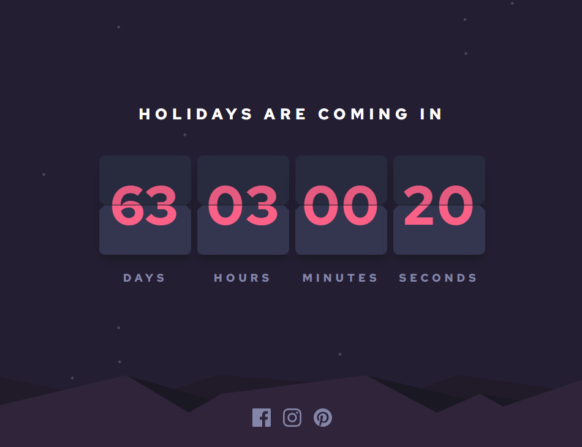

# Frontend Mentor - Launch countdown timer solution

This is a solution to the [Launch countdown timer challenge on Frontend Mentor](https://www.frontendmentor.io/challenges/launch-countdown-timer-N0XkGfyz-). Frontend Mentor challenges help you improve your coding skills by building realistic projects. 

## Table of contents

- [Overview](#overview)
  - [The challenge](#the-challenge)
  - [Screenshot](#screenshot)
  - [Links](#links)
  - [Built with](#built-with)
  - [Continued development](#continued-development)

## Overview

### The challenge

I've used this challenge to practice useRef hook in React for [this course in Udemy](https://www.udemy.com/course/modern-react-from-the-beginning/)

I made label, date & time to be props so user can specify & reset the countdown. I've made my Feb holidays a button to prepopulate to that date.

Users should be able to:

- See hover states for all interactive elements on the page
- See a live countdown timer that ticks down every second (start the count at 14 days)
- **Bonus**: When a number changes, make the card flip from the middle

### Screenshot

### Links

- Solution URL: [Countdown Timer Solution](https://www.frontendmentor.io/solutions/countdown-timer-with-react-and-tailwind-o77HWIdEGA)
- Live Site URL: [Cakes Countdown](https://cakes-countdown.netlify.app/)

## My process

### Built with

- Semantic HTML5 markup
- CSS custom properties
- Flexbox
- CSS Grid
- [React](https://reactjs.org/) - JS library
- [Tailwind](https://tailwindcss.com/) - CSS framework

### Continued development

I would like to implement the animated 'flip' of the card. I've experimented with applying class on state change of Square, however currently getting some set timeout leftovers inside use effect. I will focus on this at a later date.

Moreover, I would like to add a little corner window with today's date to have a reference.

